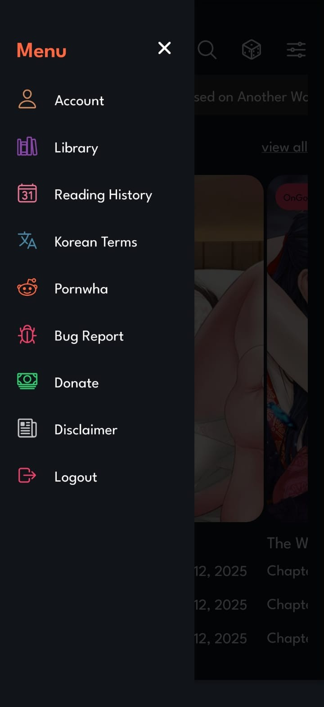

# Ougi +18 Mobile Manhwa Reader

1. Install dependencies
   
   ```bash
   npm install
   ```

2. Start the app
   
   ```bash
    npx expo start
   ```

In the output, you'll find options to open the app in a

- [development build](https://docs.expo.dev/develop/development-builds/introduction/)
- [Android emulator](https://docs.expo.dev/workflow/android-studio-emulator/)
- [iOS simulator](https://docs.expo.dev/workflow/ios-simulator/)
- [Expo Go](https://expo.dev/go), a limited sandbox for trying out app development with Expo

## Apk

Clone this repository and build an APK using the commands below, or download an APK from the [Releases](https://github.com/VitorTz/ougi-reader/releases) page.

```bash
export EAS_NO_VCS=1
eas build -p android --profile preview
```


